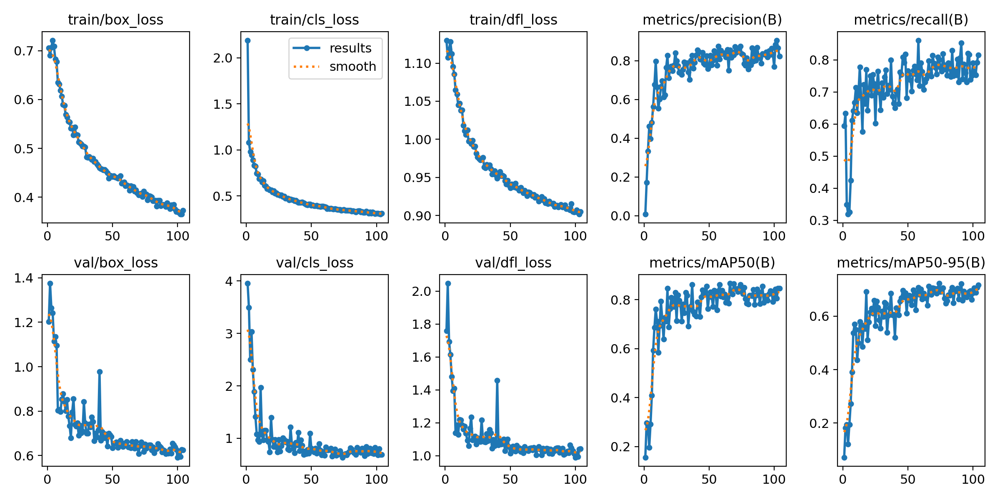
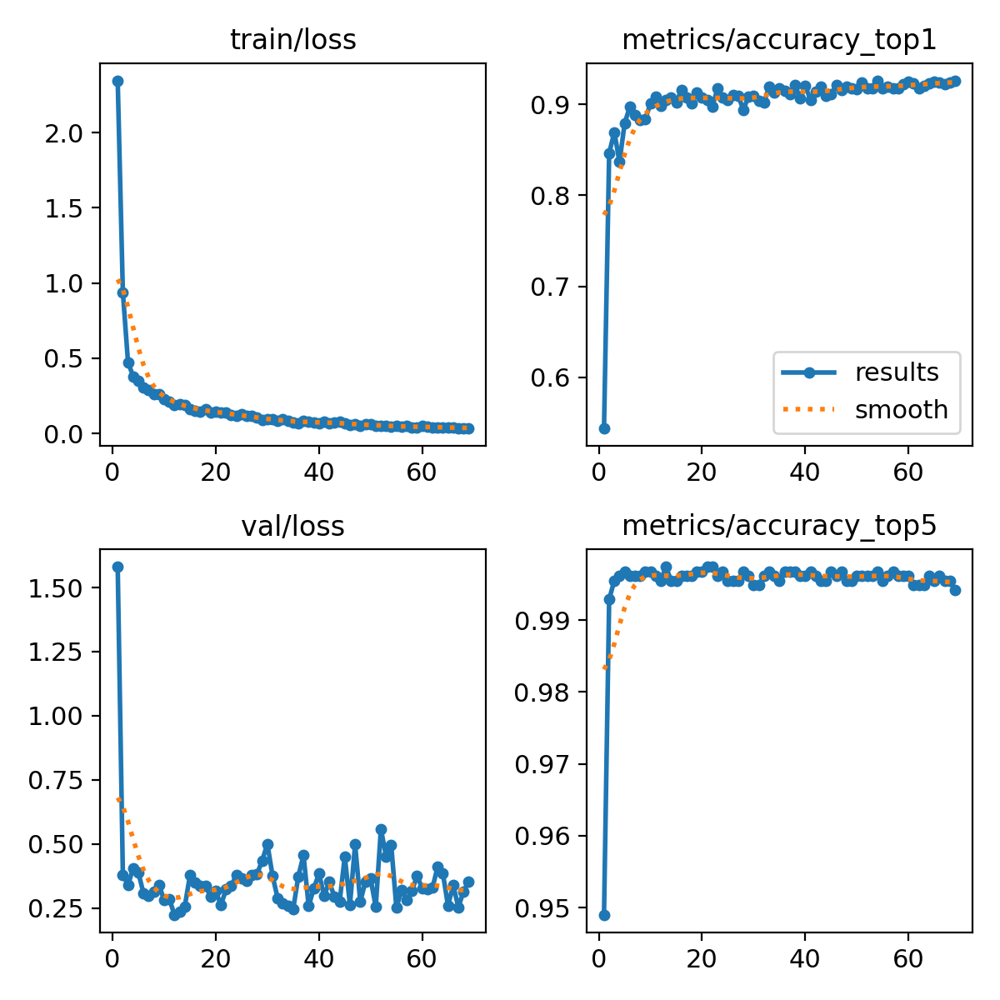
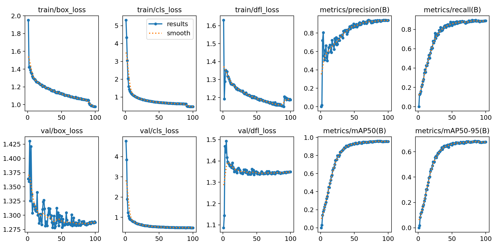
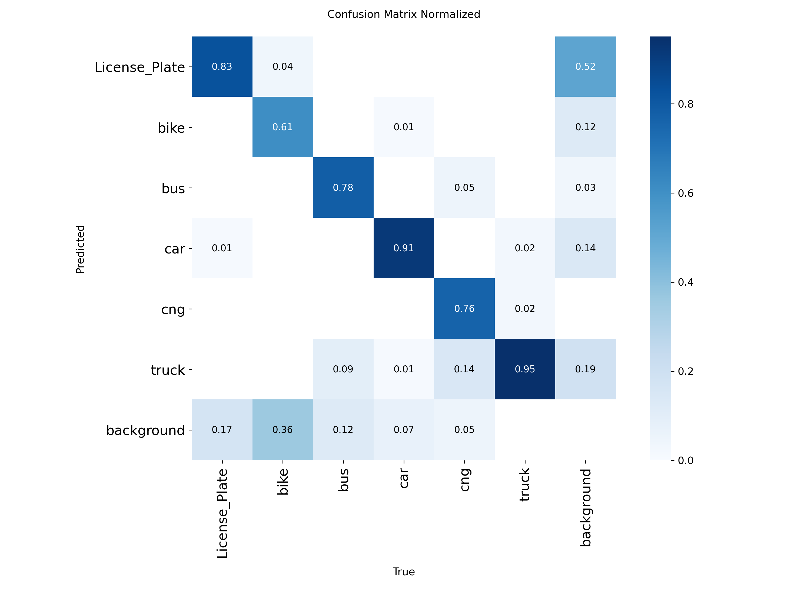
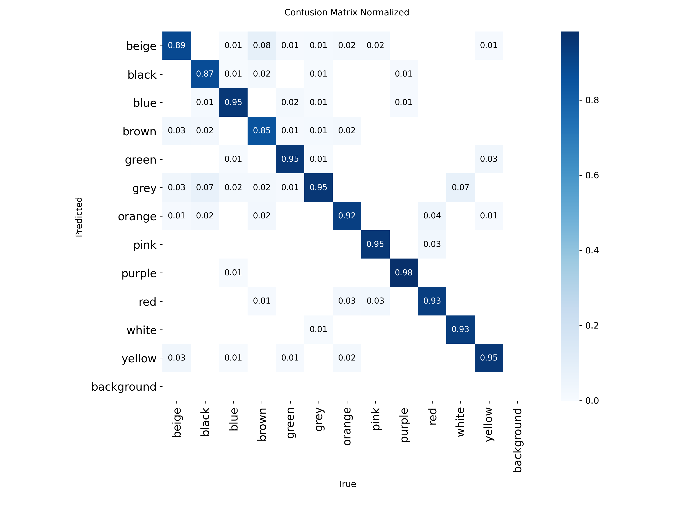
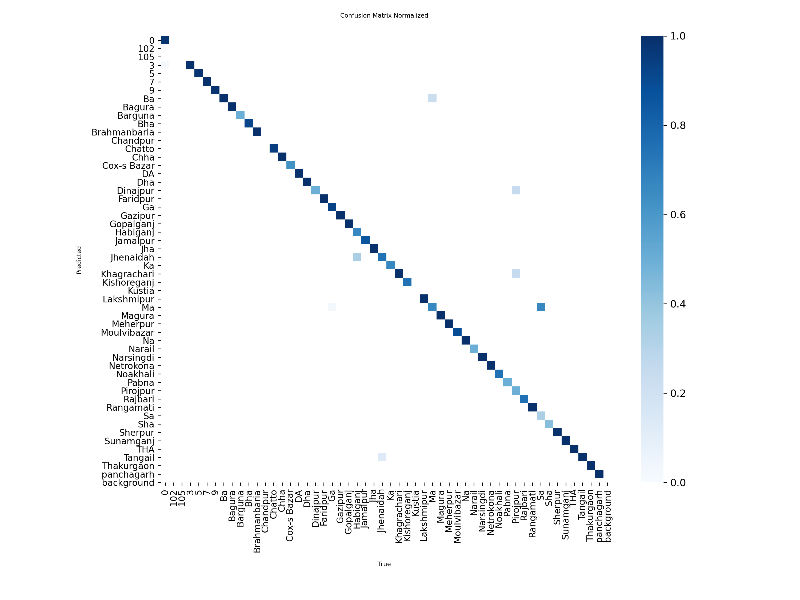
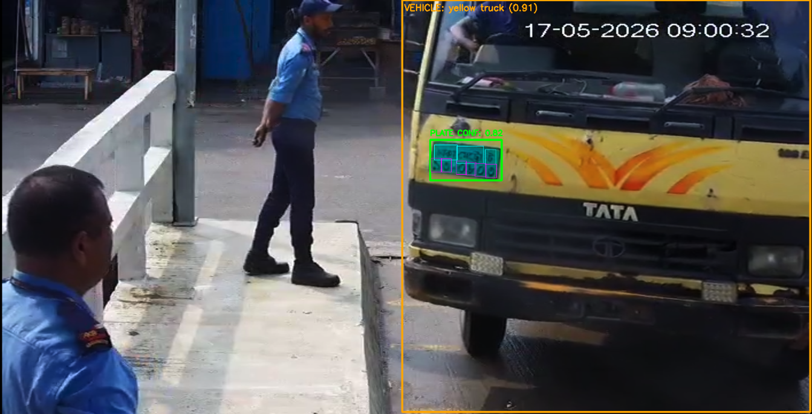
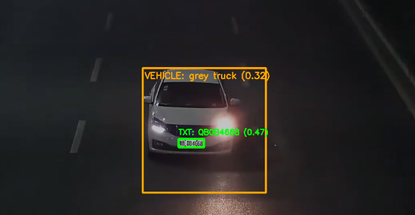

# 🚗 AI Vehicle & Number Plate Detection System

A complete deep learning system for real-time vehicle monitoring and intelligent license plate recognition.

Supports:

✅ Vehicle Detection  
✅ Number Plate Detection  
✅ Bangla Plate Recognition  
✅ English Plate Recognition  
✅ Vehicle Color Classification  
✅ Multi-Object Tracking  
✅ Excel Logging  
✅ Video & Image Processing  

---

# 🔥 Features

- YOLOv11 Vehicle + Plate Detector
- Bangla Character Detection Model
- EasyOCR English OCR Pipeline
- Vehicle Color Classification
- Real-Time Tracking using BoTSORT
- Automatic Excel Logging
- GPU Accelerated
- Optimized for Google Colab A100

---

# 🧠 Models Used

| Model | Purpose |
|------|------|
| YOLOv11 | Vehicle + Plate Detection |
| YOLOv11-CLS | Vehicle Color Classification |
| YOLOv11 Character Detector | Bangla Character Recognition |
| EasyOCR | English Plate OCR |

---

# 📊 Outputs

The system generates:

- Processed Videos
- Detected Plates
- Vehicle Information
- Excel Logs

Example Log:

| Time | Vehicle | Color | Plate |
|------|------|------|------|
| 12:30:10 | Car | White | ঢাকা মেট্রো গ ১২-৩৪৫৬ |

---

# 🧠 Pipeline Overview

1. Vehicle Detection
2. License Plate Localization
3. Plate Cropping
4. OCR / Character Detection
5. Vehicle Color Classification
6. Multi-frame Voting
7. Excel Registration Logging

---

# ⚡ Performance

Optimized for:

- NVIDIA A100
- CUDA GPUs
- Google Colab Pro

---

# 📸 Results and Outputs


# Training Results

| Model | Results |
|---|---|
| Detector | |
| Color Classifier |  |
| Bangla Character | |


# Confusion Matrices

| Detector | Color | Character |
|---|---|---|
| | |  |

### Bangla Plate Detection

### English Plate Detection


---

# 📦 Installation

```bash
git clone https://github.com/TamimHq/ai-number-plate-detection.git

cd ai-number-plate-detection

pip install -r requirements.txt
```

---

# 📥 Required Packages

```bash
pip install ultralytics
pip install easyocr
pip install opencv-python
pip install numpy
pip install pandas
pip install openpyxl
pip install torch
```

---

# 🚀 Training

## Vehicle + Plate Detector

```bash
python training/train_vehicle_detector.py
```

## Character Detection Model

```bash
python training/train_character_detector.py
```

## Color Classification Model

```bash
python training/train_color_classifier.py
```

---

# 🎥 Video Inference

## Bangla Pipeline

```bash
python inference/video_inference_bangla.py
```

## English Pipeline

```bash
python inference/video_inference_english.py
```

---

# 🖼️ Image Testing

```bash
python inference/image_test_bangla.py
```

```bash
python inference/image_test_english.py
```

---

# 🏆 Future Improvements

- Web Dashboard
- Live CCTV Integration
- REST API
- Streamlit UI
- Database Storage
- Speed Detection
- Traffic Analytics

---

# 📜 License

MIT License

---

# 👨‍💻 Author

Tamim Haque